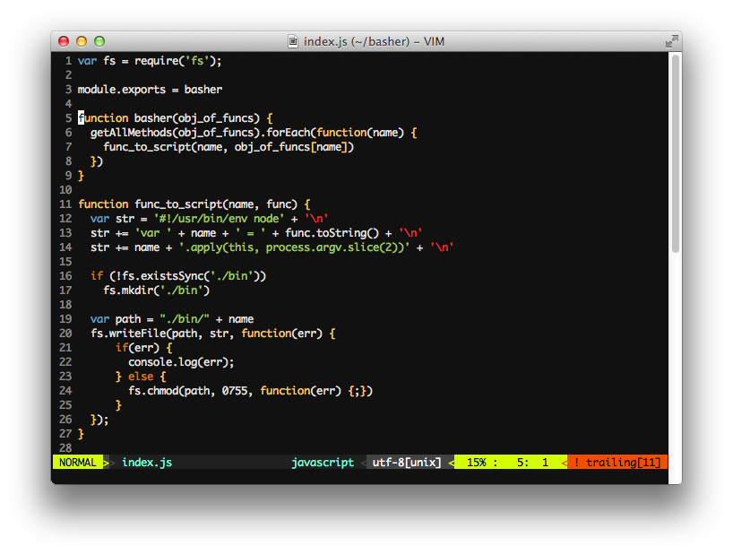

A "Fairly decent" vim setup
=============


Install
=============
```
rm -rf ~/.vimrc ~/.gvimrc ~/.vim
git clone git@github.com:seanewest/vim_config.git ~/.vim
cd ~/.vim
git submodule init   
git submodule update
ln -s ~/.vim/.vimrc ~/.vimrc
ln -s ~/.vim/.gvimrc ~/.gvimrc
```

Plugins
=============

 * [ack](https://github.com/mileszs/ack.vim)
 * [ctrlp](https://github.com/kien/ctrlp.vim)
 * [fugitive](https://github.com/tpope/vim-fugitive)
 * [greplace](https://github.com/vim-scripts/greplace.vim)
 * [nerdtree](https://github.com/scrooloose/nerdtree)
 * [supertab](https://github.com/ervandew/supertab.git)
 * [syntastic](https://github.com/scrooloose/syntastic)
 * [airline](https://github.com/bling/vim-airline)
 * [ruby-test](https://github.com/janx/vim-rubytest)
 * [rails.vim](https://github.com/tpope/vim-rails)
 * [endwise](https://github.com/tpope/vim-endwise)
